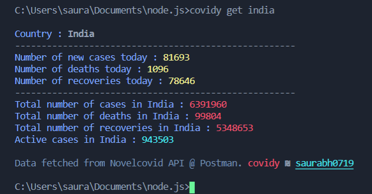
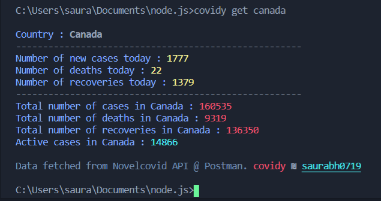

# covidy @1.0.1

Get live covid19 data of any country into your terminal window 

<p align="center">

  </p>

### Installation steps
Using npm 
```sh
$ npm install covidy -g
```
Use the 'get' command followed by the name of a country
```sh
$ covidy get canada
```
<p align="center">

  </p>