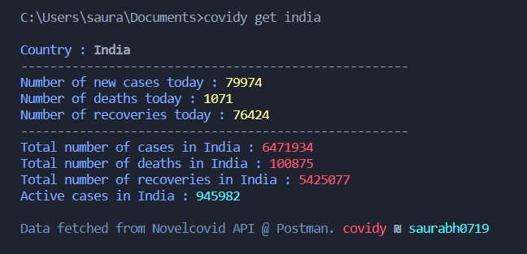
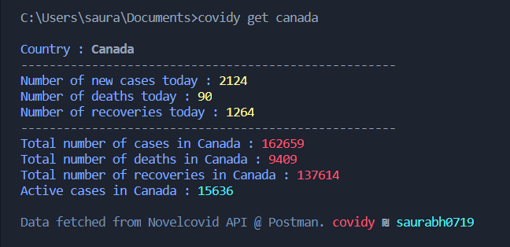
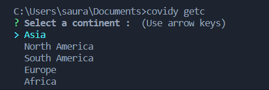
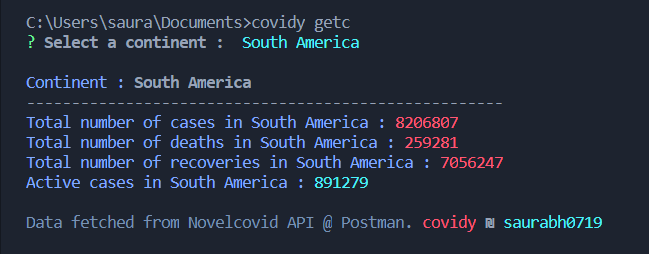

# covidy @1.0.2

Get live covid19 data of any country or continent into your terminal window 

<p align="center">

  </p>

### Installation steps
Using npm 
```sh
$ npm install covidy -g
```
Update 
```sh
$ npm update covidy -g
```

### Usage guide
Get a country's covid stats (get)
```sh
$ covidy get <country_name>
```
<p align="center">

  </p>

Get a continent's covid stats (getc)
```sh
$ covidy getc
```
<p align="center">

  </p>
<p align="center">

  </p>